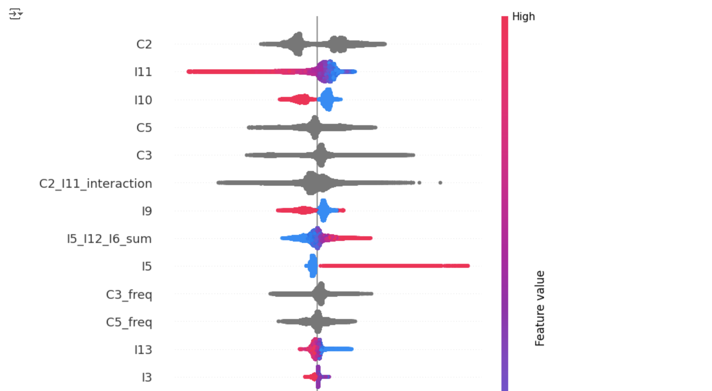
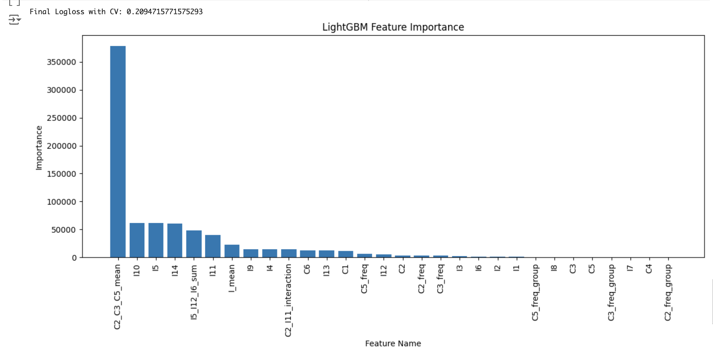

# Signate Ad Click Prediction

## 【練習問題】ネット広告のクリック予測
インターネット広告配信プラットフォームのログデータから、広告のクリック有無を予測するプロジェクトです。

---

## ✅ 1. プロジェクトタイトルと概要

### 広告クリック予測コンペティション
このプロジェクトでは、広告クリックの有無を予測するための分類モデルを作成しました。

#### 使用した手法
- LightGBM
- CatBoost
- ニューラルネットワーク（NN）
- 加重アンサンブルモデル
- スタッキングモデル

#### 評価指標
- Logloss

#### コンペティション概要ページ
- [コンペティション概要ページ](https://www.signate.jp)

#### データ概要
- **課題種別:** 分類
- **データ種別:** 多変量
- **学習データサンプル数:** 1,169,042
- **説明変数の数:** 20
- **欠損値:** あり


---

## ✅ 2. データセット

### データセット概要
- **学習データ**: `data/sample_train.csv`（データの最初の10行のみ）
- **元データの取得**: コンペティションページから直接ダウンロード可能。
- **目的変数**: `Clicked`（1=クリックあり, 0=クリックなし）

**サンプルファイル形式の違い**  
今回提供されたファイル形式は`TSVファイル`ですが、GitHub上では`CSVファイル`のサンプルを掲載しています。

### データの読み込み例（Python）
```python
import pandas as pd

file_path = '/content/drive/My Drive/signate/train/train.tsv'
df = pd.read_csv(file_path, low_memory=False, sep='\t')
df.head()
``` 
---

## ✅ 3. プロジェクトの構成（フォルダ説明）
```

├── data                  # データセット（サンプルデータのみ）
│   └── sample_train.csv  # 学習データのサンプル
│   └── sample_test.csv   # テストデータのサンプル
├── notebook              # Jupyter Notebookファイル（EDA・モデル検証）
│   └── train.ipynb
│   └── test.ipynb
│   └── EDA.ipynb
├── models                # トレーニング済みのモデルコード
│   └── lightGBM.ipynb
│   └── catboost.ipynb
│   └── XGBoost.ipynb
│   └── nn.ipynb
│   └── ensemble.ipynb
│   └── stacking_NeuralNetwork.ipynb
├── images                # 可視化画像（EDAや結果のグラフ）
│   └── lightgbm_feature_importance.png
│   └── shap_plot.png
├── README.md             # このファイル（プロジェクト説明）
├── .gitignore            # 無視するファイルリスト

``` 
---

## ✅ 4. 使用した手法・アプローチ

### モデルとヴァージョン
- LightGBM: 3.3.2
- CatBoost:1.2
- XGBoost:1.6.2
- ニューラルネットワーク: TensorFlow 2.9.1

### データ前処理
- **欠損値処理**：平均値補完
- **クラスタリングアルゴリズム**を使用して、自動的に出現頻度をグルーピング
- **カテゴリ変数のエンコーディング**：One-Hot Encoding
- **特徴量作成**：SHAP値から新しい特徴量を作成
- **特徴量エンジニアリング**：カテゴリ変数の数値化

### SHAP値の可視化

以下の図は、SHAP（SHapley Additive exPlanations）のプロットであり、特徴量の重要度と影響方向を可視化しています。



#### 解説:
- 特徴量`I11`と`I5_I12_I6_sum`の影響が特に強く、モデルの予測に大きく寄与していることがわかります。
- 赤は正の寄与、青は負の寄与を示しています。

### LightGBMの特徴量重要度

以下のグラフは、LightGBMモデルが予測時に重視した特徴量の重要度を可視化したものです。



#### 解説:
- `C2_C3_C5_mean` が圧倒的に重要な特徴量であることがわかります。
- 特徴量の寄与度が高いものを中心にモデルの解釈を行いました。


---
## ✅ 5. 成果と評価

### 成果と評価
- **最終順位**: 187人中50位（上位26%）
- **最良スコア**: Logloss = 0.1999

### 反省
- モデルの過学習への対応が不十分だった。
- **LightGBM、CatBoost、XGBoostの相関性が非常に高く（96%以上）**であり、アンサンブルの効果が限定的だった。
- **スタッキングモデルの効果不足**  
   ベースモデルとしてLightGBM、CatBoost、XGBoostを使用し、メタモデルとしてニューラルネットワークを適用したが、精度の向上は見られなかった。
- **データの特性に対する課題**  
   今回のデータセットは匿名データセットであり、特徴量間に**非線形の関係**が見られたため、特徴量エンジニアリングのさらなる工夫が必要である。

## ✅ 6. 今後の改善点
- モデルの解釈性向上（SHAP可視化の充実）
- 相関性の高いモデルの削減と多様性の強化
- 特徴量エンジニアリングの強化（非線形特徴量の作成）
